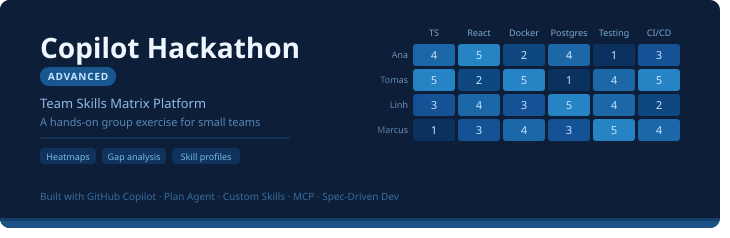

Welcome to the advanced GitHub Copilot hackathon. This is a hands-on group exercise designed to be completed over the course of a few hours. You will work in small teams (ideally 3–4 people sharing one driver's screen, rotating regularly) to build a non-trivial application end-to-end while exercising the full breadth of Copilot's advanced capabilities — custom instructions, the Plan Agent, custom Skills, MCP servers, spec-driven development, and subagent orchestration.

The goal is **not** to finish every section. The goal is to experiment with each technique, discuss what works and what doesn't with your team, and leave with a feel for how to combine these tools in your day-to-day work. Treat the steps below as a guided menu: move at a pace that lets you actually reflect on each step, and skip ahead if a section is less relevant to your team.

## 🛠️ 1. Preparations
1. Create a shared repository for the project so your team can collaborate on the implementation (for example, in your company's source control system or a personal GitHub account).
1. Align on the language and technology stack you want to use. Since Copilot will support most of the implementation, a solid general programming understanding is usually enough regardless of the stack you choose.
1. Pick the first "driver" and start the assignment using screen sharing.

## 🎯 2. The Assignment

Your task is to design and build — using GitHub Copilot — a **Team Skills Matrix Platform** that tracks skills across engineering teams. The platform should give engineering leaders visibility into the current capabilities of their organization, highlight gaps against target competency levels, and guide individual development through training recommendations.

### Product vision
A web application where:
- **Engineers** maintain a profile of their current competency level across a defined set of skills.
- **Team leads and managers** browse an inventory of engineers (with name, team, role) and drill into individual profiles.
- **The organization** maintains a shared **skills inventory** with target levels per skill.
- **Heatmaps** visualize team-level proficiency at a glance and allow leads to set/adjust engineer levels inline.
- **Gap analysis** ranks skills by the largest delta between target level and team average.
- **Training recommendations** suggest the next learning steps for each engineer based on their gaps.

### How you will build it

This hackathon is as much about *how* you build as *what* you build. You will practice the full set of Copilot capabilities:

1. **Project-level custom instructions** — establish the architectural foundation (monorepo layout, frontend/backend stack, datastore, dev environment, testing requirements) so every Copilot interaction is grounded in your conventions.
2. **Plan Agent + autopilot** — design the foundational features (skills inventory, engineer profile, engineers inventory) collaboratively with Copilot before implementation.
3. **Refined and path-scoped instructions** — split guidance into backend, frontend, and area-specific files as the codebase grows.
4. **Custom Skills** — package repeatable workflows (running unit tests with coverage analysis, writing backend unit tests, writing browser tests) as agentic skills Copilot can invoke.
5. **MCP servers** — wire up Playwright MCP so Copilot can inspect the UI in a real browser, and evaluate which other MCPs (PostgreSQL, GitHub, GitLab, …) add value.
6. **Spec-Driven Development with OpenSpec** — deliver the remaining features (team heatmaps, skill gap analysis, training recommendations) as individual change proposals.

The sections below walk through each of these steps in order. Work through them with your team, iterating with Copilot at every stage.

## 📜 3. Add project-level custom instructions
Add high-level custom instructions for the entire project in the correct location (.github/copilot-instructions.md or ./AGENTS.md). Include guidance that defines the architectural foundation of the project, for example:
- A monorepo with separate frontend and backend applications
- Implementation technologies
- Datastore technologies (for example, lowdb or PostgreSQL)
- Development environment technologies (if any, for example Docker Compose)
- Testing guidelines

Also include quality assurance instructions that define test automation requirements:
- All backend functionality must be covered by unit tests (use mocking to isolate business logic from the database layer)
- All major user flows must be covered by browser tests

## 🏗️ 4. Foundational features
- Using the Plan Agent, create a plan for implementing the foundational features of the application:
    - **Skills inventory:** A list of skills and target levels, with the ability to add, update, and delete skills.
    - **Engineer profile:** An engineer's current competency levels across all skills.
    - **Engineers inventory:** A list of all engineers, including name, team, role, and links to their profiles.
- Iterate on the plan until your team is happy with it.
- Pay attention to the UI look & feel requirements when creating the plan.  
- Start implementing the plan using autopilot.

Before continuing with further feature implementation, add the agentic capabilities described in sections 5-7 to the project.

## ✨ 5. Refining the project instructions
After implementing the foundational features, revisit the custom instructions and refine them. For example:
- Split backend and frontend guidance into separate instruction files.
- Add code style guidance for specific parts of the project, possibly in path-scoped instruction files.
- Add description of the project layout

Tip: use Copilot to improve the instructions.

## 🧪 6. QA Skills
Choose one of the following ideas and implement it as a skill to support writing and maintaining automated tests for the project.
- Implement an Agentic Skill that enables Copilot to run unit tests with code coverage analysis and then recommend which parts of the codebase need additional unit tests. Use a combination of instructions and scripts in the skill to parse and analyze coverage results.
- Implement a skill for writing backend unit tests that defines testing standards, such as test style, general principles, framework usage, test scope, and mocking strategy.
- Implement a skill for writing frontend browser tests that defines standards for test case design and coverage of key user flows.

## 🔌 7. MCPs
Let's add some MCP servers to the project.
1. Configure Playwright MCP so Copilot can inspect and test the UI in a real browser.
1. Evaluate which additional MCP servers could benefit the application, such as PostgreSQL MCP, GitHub MCP, or GitLab MCP.

## 📐 8. Additional Features Using Spec-Driven Development
Install [OpenSpec](https://github.com/Fission-AI/OpenSpec/#quick-start) and use it to implement the remaining requirements, with **each requirement delivered as a separate change proposal:** 
- **Team heatmaps:** A heatmap that both visualizes proficiency levels and allows setting engineer levels.
- **Skill gap analysis:** Skills sorted by the largest gap (organization target vs average skill of the team).
- **Training recommendations:** Per-engineer recommendations on which trainings to take next.

**Remember:** the point of Spec Driven Development is to **design the features and their implementation in detail.** Carefully review the produced design documents before moving to applying the changes to make sure you are aligned with the AI on the feature, requirements and implementation details.

While implementation is in progress, keep an eye on the following:
- Does Copilot follow the project instructions?
- Does Copilot use the Agent Skills and MCPs defined for the project?
- Are test cases being written as part of the implementation?
- Is the implementation verified after each iteration using unit and/or browser tests?

## 🕵️ 9. Bonus exercise: Custom Agents
1. Using subagent orchestration patterns, design a custom agent for reviewing the application code. Name the agent "Thorough Reviewer." Define 2-3 review perspectives, then implement the agent to use subagents to investigate the repository and report issues from each perspective.
2. Implement an IaC-focused custom agent. The team should choose a target platform (for example, a Kubernetes cluster or a FaaS environment), then create an agent that uses an infrastructure framework (for example, Pulumi, Terraform, or Ansible) to define the infrastructure required by the application and automate deployment. Finally, use the agent to implement the IaC code.